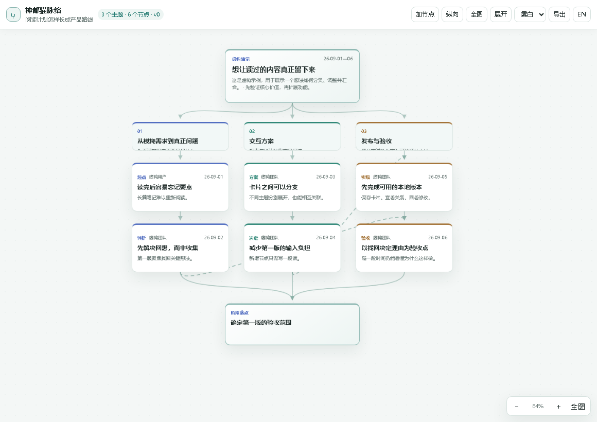
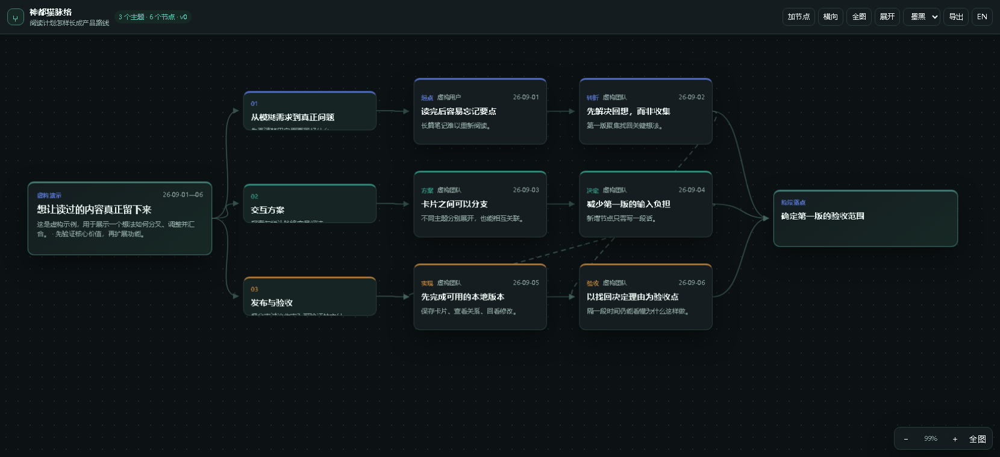
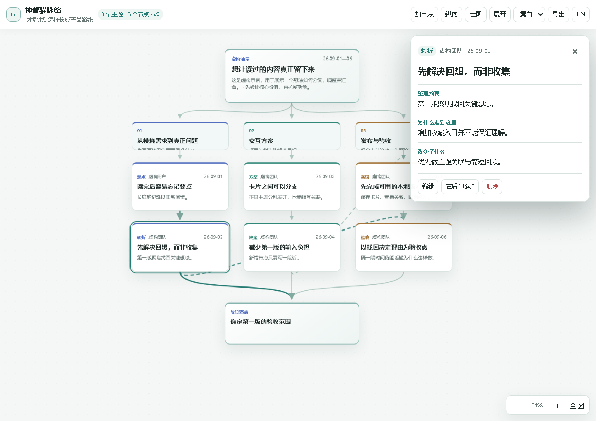

# 神都猫脉络（Shendumao Context Map）

把长期对话中的初心、主题分支、转折、决定理由和待办事项整理成一张可回看的思路地图。地图保存在本机，可以在后续任务中增量更新、手工编辑节点，并回看每次保存的历史版本。

Codex 版已完成跨平台安装测试；现另提供 **WorkBuddy 试用适配包**，等待 WorkBuddy 桌面宿主中的图形画布验证。两版都是本地插件，不是需要常驻网页服务器的 SaaS；正常使用不需要访问 `127.0.0.1`。

## 界面预览与演示

以下图片由插件的实际地图组件和**虚构演示数据**生成，不含真实对话；可看到主题分叉、跨主题关联和阶段落点。



| 横向布局与深色风格 | 点击节点查看决定原因 |
| --- | --- |
|  |  |

想自己试用交互，可下载 [独立 HTML 演示页](docs/demo.html)（在 GitHub 文件页点 **Raw**，保存为 `demo.html` 后用浏览器打开）。它无需安装插件或启动服务，支持切换布局/风格、缩放和查看节点详情；演示数据只读，不能读取 Codex 对话，也不会保存地图。真正的创建、增量更新和持久化需要安装插件。

## 能做什么

- 从当前可见对话或用户提供的规划创建地图；按问题分出多个顶层主题，而不是机械地按消息顺序排列。
- 通过 Codex 增量增加、修改、移动或删除主题与节点；每次写入形成不可变版本，保留修改原因和可用的来源线索。
- 在地图界面中查看分支/关联、切换横向或纵向布局、缩放、切换浅色/深色等主题，并轻量编辑节点。
- 导出结构化 JSON；菜单可切换中文/英文，原对话内容不会被自动翻译。

**当前边界：**插件不会自动监听每轮聊天，也不会在未经宿主授权时读取其他 Codex 任务。想更新地图，需要在任务中明确请 Codex 更新，或在图内手工编辑。插件界面能否永久固定在右侧由 Codex 宿主决定。规划脑图的完整自由拖动、导入外部脑图等仍属于桌面原型能力，尚未进入本插件。详见 [插件能力说明](plugins/shendumao-context-map/README.md)。

## WorkBuddy 安装试用（Windows / macOS）

**推荐先在 WorkBuddy 对话中发安装请求**，让它检查仓库和本机环境，并在其权限范围内尝试安装：

> 请帮我安装这个 WorkBuddy 插件：https://github.com/signerzwb/shendumao-codex-context-map 。先阅读仓库里的 WorkBuddy 试用说明，核对插件来源、安装内容和 Node.js 要求；如果你能管理插件市场，就添加这个仓库并安装 `shendumao-context-map@shendumao-workbuddy`。需要我确认权限或在界面中操作时请明确指出，不要假装已经安装成功。完成后告诉我是否需要重启或新建任务，并验证 `render_context_map` 是否可用。

这是一条交给 WorkBuddy 执行的任务，**不是已确认的“粘贴链接自动安装”内置功能**。如果当前版本不能从对话管理插件，请按 [WorkBuddy 试用说明](plugins/shendumao-context-map-workbuddy/README.md) 在「插件」页添加第三方市场并安装；该文档也有备用 MCP 配置和测试步骤。

在中国大陆网络下访问 GitHub 不稳定时，[WorkBuddy 试用说明](plugins/shendumao-context-map-workbuddy/README.md#github-访问不畅时的对话指令)还提供了第三方加速链接和对应的对话指令。它只作为下载备用，不是项目官方发布地址；优先使用原始 GitHub 仓库。

WorkBuddy 适配目前是**画布待复测版**：已有 Windows 用户反馈插件和 MCP 工具可加载，v0.2.1 修复了画布结果只依赖 `_meta` 的问题；仍不能保证你的 WorkBuddy 版本支持 MCP Apps 画布。不能把 Codex 的安装命令直接复制到 WorkBuddy。

## Codex：在另一台电脑安装（Windows / macOS）

先安装 Codex 和 **Node.js 18 或更高版本**，并确认终端可以运行 `codex --version` 与 `node --version`。本仓库已经提交运行用的单文件服务包与网页资源，普通安装无需执行 `npm install`、`npm run build`，也不需要单独启动服务。

### 推荐：把仓库地址交给 Codex 安装

在要使用插件的电脑上，打开具有本机终端和网络访问能力的 Codex 任务，发送：

> 请帮我安装这个 Codex 插件：https://github.com/signerzwb/shendumao-codex-context-map 。先阅读仓库 README，检查 Node.js 和 Codex 是否可用，再按 README 中的 GitHub marketplace 步骤安装并验证结果。需要执行命令或联网授权时请让我确认；不要运行仓库以外的安装脚本。最后告诉我是否需要重启 Codex。

这不是“只粘贴链接就自动安装”的特殊功能；Codex 仍需按以下步骤执行命令，且可能受本机权限、网络或组织策略限制。如果当前任务没有终端能力，使用下面的手动方式。

### 手动安装

在 PowerShell（Windows）或 Terminal（macOS）中运行：

```sh
codex plugin marketplace add signerzwb/shendumao-codex-context-map
codex plugin marketplace list
codex plugin add shendumao-context-map@shendumao
codex plugin list
```

也可以在 Codex 桌面版的插件目录中选择 `神都猫` 来源，再安装 `神都猫脉络`。安装后**完全退出并重新打开 Codex，创建一个新任务**，让新任务加载插件的技能与 MCP 工具。

可用这句话开始：

> 用神都猫脉络把当前对话整理成一张思路地图，保留初心、分支、决定理由和下一步，并打开地图。

如需根据指定的历史任务建立地图，可以提供 `codex://threads/...` 链接，但只有当前宿主实际提供相应任务读取能力时才能读取；否则需要先打开该任务或提供导出的内容。

### 更新

仓库发布新版本后：

```sh
codex plugin marketplace upgrade shendumao
codex plugin add shendumao-context-map@shendumao
```

然后重启 Codex 并新建任务。地图数据存储在独立的用户数据目录，更新插件代码不会删除它；重要地图仍建议自行备份。

### 卸载和数据

用 `codex plugin list` 确认安装状态；如要卸载，先运行 `codex plugin remove shendumao-context-map@shendumao`。**卸载插件与删除地图数据是不同操作**：不要直接删除数据目录，除非已经备份且明确不再需要。默认数据位置和 `SHENDUMAO_DATA_DIR` 覆盖方式见[插件说明](plugins/shendumao-context-map/README.md#持久化位置)。

## 项目结构

```text
.agents/plugins/marketplace.json        Codex marketplace 目录
.codebuddy-plugin/marketplace.json      WorkBuddy / CodeBuddy marketplace 目录
plugins/shendumao-context-map/
  .codex-plugin/plugin.json             插件元数据
  .mcp.json                             Codex 启动 MCP 的配置
  mcp/server.bundle.mjs                 已打包的跨平台 Node 服务
  assets/context-map-widget.html        自包含交互界面
  skills/visualize-context/SKILL.md     对话整理规则
  tests/                                自动测试
plugins/shendumao-context-map-workbuddy/ WorkBuddy 独立安装包（由主服务同步运行文件）
```

`marketplace.json` 使用仓库内的相对路径，不包含开发电脑的绝对路径。因此安装源可以是 GitHub 仓库、克隆后的本地目录，或 Codex 支持的其他 marketplace 来源。

## 开发与验证

在 `plugins/shendumao-context-map` 中运行：

```sh
npm ci
npm run build
npm test
```

代码更改后要重新构建并提交 `mcp/server.bundle.mjs`；仅修改源码而不更新 bundle，不会改变用户安装后的实际服务。GitHub Actions 在 Windows 和 macOS 上运行构建与测试。发布更新时同步提升插件版本，并在另一台机器重新执行 marketplace upgrade / plugin add。

改动运行文件后还需在仓库根目录运行 `node scripts/sync-workbuddy.mjs`，把同一服务包和界面资源同步到 WorkBuddy 安装包；CI 会用 `--check` 校验两边一致。

如修改了地图组件或虚构演示数据，运行 `npm run build:demo` 重新生成 `docs/demo.html`，并检查预览图是否需要更新。

## 隐私与来源

地图默认只保存在本机。插件的 MCP 服务只接收 Codex 显式传给它的参数，不会自行抓取任务数据库或后台监听对话。示例地图是演示数据，不包含用户的完整历史对话。整理时应保留原文，明确区分用户原话、AI 报告、归纳与推测。

## 交流与反馈

QQ 交流群：**340983417**。欢迎反馈安装问题、地图体验与功能建议；报告故障时请勿公开粘贴包含私人对话或凭据的地图文件。

## 许可

[MIT](LICENSE) · 作者：神都猫
